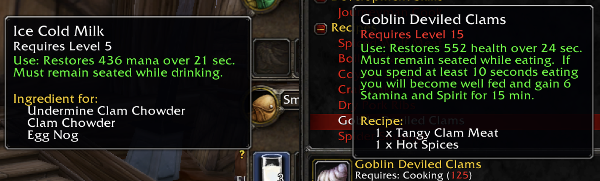
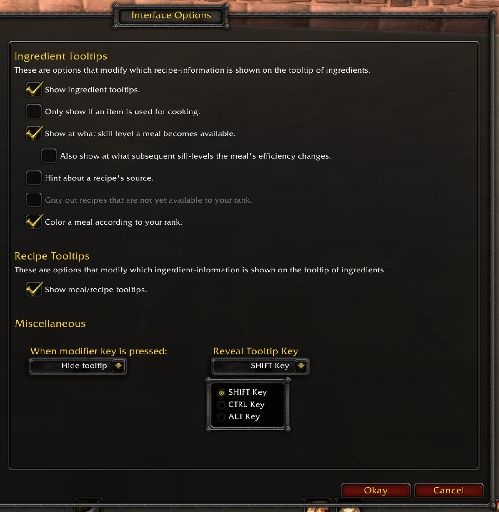

# BITES 🍗  (Better Ingredients Tracking for Efficient Seasoning)

### `An adventurer's recipe tome`

A lightweight add-on for World of Warcraft classic (vanilla) that shows you which cooking ingredients can be used to cook meals with.

## What is BITES?

BITES (Better Ingredients Tracking for Efficient Seasoning) is an add-on for World of Warcraft Classic designed to streamline the cooking process for players. With a vast selection of meals, ingredients, and other items, it can be difficult to know which ingredients are necessary for cooking different recipes. BITES solves this problem by displaying a mouseover tooltip that indicates which meals an ingredient can be used for, saving players time and reducing the chances of accidentally throwing away or selling valuable ingredients. The add-on also provides a customizable interface, giving players control over the information they receive. Whether you are a seasoned WoW player or just starting out with the cooking profession, BITES makes it easier to keep track of your ingredients and cook up delicious meals.

## How does it work?
You will notice that scrolling over an item will now display an additional tooltip with new cooking-related information. For example, a meal will list the ingredients in requires for its recipe, while an item that can be used as an ingredient will list all the meals it can be used for.

 
## How to install?

You can install BITES just by pasting the BitesCookBook folder into your game's add-on directory. This is usually located in your installation directory. (For more information see this helpful article: https://www.wowisclassic.com/en/addons/installation/)

## Customizations for any player-style.

BITES aims to be as unobtrusive and informative as possible. For this reason, it features an extensive customization menu that allows players to choose which additional information is available to them. Consider the following two examples:

* The RPG Enjoyer: You only want to know which items can be used as ingredients so that you don't trash them? No problem, BITES has you covered.
* The Efficiency Optimizer: You want to know exactly when a recipe is available to you, and at what skill level it will stop producing levels efficiently? You want to reveal or hide the tooltip to keep your screen clean? BITES can do that too!

On top of that, the add-on offers support for customized profiles between characters.

 

## For developers
This repository also features code written in python that can be used to generate the data used by the add-on. This is located in `wowhead_archive` and managed by the `wowhead_scrapping.ipynb` notebook and the `tradeskill_reader.py` files in Python. Look at the notebook for a tutorial on how to use and modify.